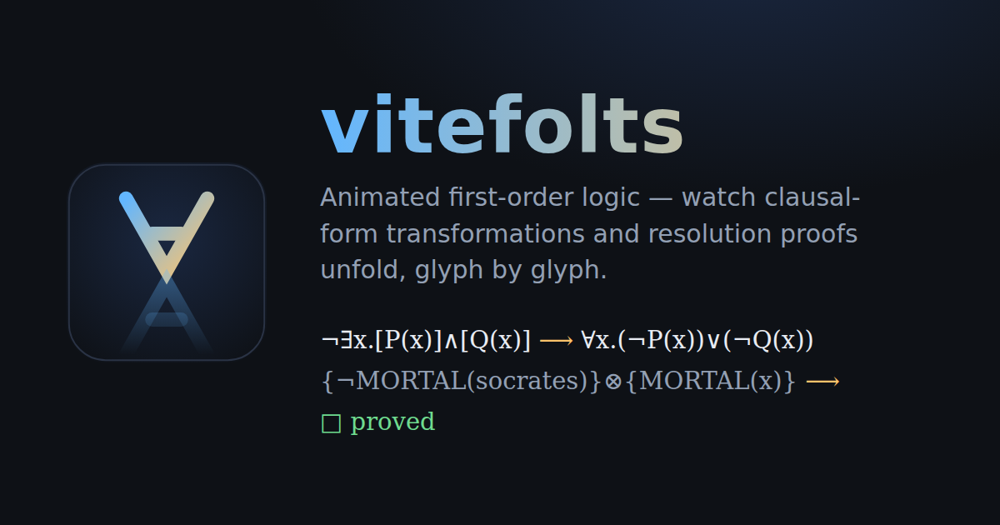

<p align="center">
  <a href="https://rudi-cilibrasi.github.io/vitefolts/"></a>
</p>

# vitefolts

[](https://rudi-cilibrasi.github.io/vitefolts/)



## vitefolts: A TypeScript First Order Logic Engine

**vitefolts** is a project aimed at building a TypeScript-based First Order Logic (FOL) engine. The name "vitefolts" is derived from its integration with a Vite frontend. More information about Vite can be found at [vitejs.dev](https://vitejs.dev/).

**Live demo: [rudi-cilibrasi.github.io/vitefolts](https://rudi-cilibrasi.github.io/vitefolts/)** — step an axiom set through the full clausal-form pipeline (eliminate `→`, eliminate `↔`, cancel `¬¬`, push `¬` inward, Skolemize `∃`, drop `∀`, distribute `∨` over `∧`) and watch each rewrite animate: surviving symbols glide along quadratic Bézier splines with time-parameterized easing, and mirror-image conversions animate as reflections — a De Morgan step literally flips `∧` upside down into `∨` (scaleY 1 → −1), and `∃` flips into `∀`. Deleted symbols fade out; new symbols pop in.

Formulas are typeset as native **MathML** with a bundled STIX Two Math font (italic variables, real operator spacing — no LaTeX runtime needed). Animation still works on top: each transition renders the old and new formulas, measures every `<mi>/<mo>/<mn>` token, and animates absolutely-positioned DOM "sprites" cloned from those tokens between the two layouts, swapping in the true MathML render at the end.

Then **prove a conjecture**: pick a conjecture φ and the engine refutes axioms ∧ ¬φ by **linear resolution with paramodulation** — unification with occurs check, binary resolution, factoring, and equality rewriting, searched by iterative deepening so the shortest proof is found. Every derivation animates with the same glyph engine: the parent clauses fuse, the resolved complementary literals annihilate, and unified variables visibly morph into their substituted terms, ending at the empty clause `□`. Conjectures that don't follow (try `GOD(socrates)`) report an honest search failure.

And **build your own theory**: the **Custom ✎** tab has a formula editor — axioms and conjectures, one per line, with optional `label:` prefixes and `#` comments. The parser accepts exactly what the app displays (so `✎ edit in editor` copies any built-in example in for tweaking, verified round-trip), and **no special keyboard is needed**: ASCII converts to symbols live as you type — `forall`→`∀`, `exists`→`∃`, `~`→`¬`, `&`→`∧`, `|`→`∨`, `->`→`→`, `<->`→`↔`, `*`→`·` — with an on-screen key legend, clickable symbol buttons, and paste conversion (comments after `#` are left alone). Symbol roles and arities are inferred from use — names applied in formula position are predicates, in term position functions; bare `u`–`z` or quantifier-bound names are variables, anything else is a constant. A typed-conjecture box next to the menu lets you pose your own question on any example.

Six example theories are included, each chosen so a different pipeline step or inference feature gets a dramatic moment:

- **Peano arithmetic** — the classic axioms, plus a `¬∃x.[NAT(x)]∧[succ(x)=0]` row that double-flips under De Morgan; with the successor-addition axiom it proves `1 + 1 = 2` by paramodulation.
- **Group theory** — closure, associativity, identity, inverses; the "nontrivial" axiom `¬∀x.x=e` flips its quantifier into `∃x.¬(x=e)`.
- **Socrates & the gods** — syllogisms where `¬∃x.¬MORTAL(x)` cancels a hidden double negation into `∀x.MORTAL(x)`.
- **Wolf, goat & cabbage** — the classic river crossing as pure logic: only safe crossings are axioms, and proving `REACH(R,R,R,R)` yields an 8-step refutation that *is* the farmer's ferry plan.
- **Safety interlock** — propositional rules whose biconditionals mint genuine `¬¬` pairs, giving the `¬¬` cancel step real work.
- **Ancestry** — everyone has a parent (`∀x∃y.PARENT(y,x)`), so the `∃` under the `∀` Skolemizes to a real unary function `σ(x)` rather than a constant; prove everyone has an ancestor.

### Properties of vitefolts

Logic involves the systematic construction ("deduction") of truth through formal methods, which can often be automated. First-order logic (FOL) is a particular subset of logic that offers several user-friendly properties:

- **Expressiveness**: FOL can discuss countable infinities and rules of "always" or "never".
- **Mathematical Foundation**: Much of classical mathematics, particularly those based on Zermelo-Fraenkel set theory, can be expressed in FOL.
- **Proof Techniques**: FOL has straightforward and complete techniques for constructing and verifying proofs.
- **Understandability**: Compared to the "black box" nature of neural networks and deep learning, FOL is relatively easy to understand.
- **Automation**: It supports deduction verification and automated search using techniques like linear resolution with paramodulation.

### Differentiating Features of vitefolts

vitefolts distinguishes itself through its data structure design, relying entirely on persistent functional data structures. Key features include:

- **Persistent Functional Data Structures**: Each operation appends information to a "TruthBag" following formal logic rules. Despite keeping all historical versions of every data structure, memory usage remains efficient due to shared data and TypeScript's garbage collection. Parallelism and consistency capability is amplified.
- **Immutable.js**: Utilizes Immutable.js for underlying state management, ensuring value semantics for logical expressions. This facilitates automatic deduplication of logical sentences without explicitly defining equality relations.
- **Parallelism and Lock-free Operation**: The system supports parallel search and avoids the need for locks. Each version of the TruthBag remains valid, enabling the use of multi-core CPUs, computing clusters, or distributed computing using web browser JavaScript engines.
- **Error Prevention**: The use of immutable data structures prevents many errors common in mutable data structures used in OOP languages.

### Core Logic of vitefolts

vitefolts is based on First Order Logic with Paramodulation, supporting standard propositional logical operations, universal and existential quantifiers, and equality. For reference, here are Peano's Axioms in vitefolts' terms:

Peano Axioms Example

### Name | Type | Arity
| Name  | Type      | Arity |
|-------|-----------|-------|
| NAT   | Predicate | 1     |
| 0     | Function  | 0     |
| succ  | Function  | 1     |
| +     | Function  | 2     |

### Sentences


| Sentence                                                                           | Description   |
|------------------------------------------------------------------------------------|---------------|
| [NAT(x)]∧[NAT(y)]∧[NAT(z)] → [x=y]∧[y=z] → x=z                                      | [transitivity]|
| ∀x.NAT(x) → x=x                                                                    | [reflection]  |
| NAT(0)                                                                             |               |
| ∀x.x+0=x                                                                           |               |
| NAT(x) → NAT(succ(x))                                                              | [closure]     |
| [NAT(x)]∧[x=y] → NAT(y)                                                            | [closure]     |
| succ(x)=succ(y) → x=y                                                              |               |
| ∀x.succ(x)=0                                                                       |               |
| [NAT(x)]∧[NAT(y)] → x=y ↔ y=x                                                      | [symmetry]    |

For an introduction to clausal form and the resolution procedure, visit [Stanford's Resolution Procedure](http://intrologic.stanford.edu/extras/resolution.html).

For a longer guide have a look at the [Open Logic Project](https://builds.openlogicproject.org/open-logic-complete.pdf) book

If you prefer videos, here is a [good one by Adam Pease](https://www.youtube.com/watch?v=J3Pm43O48Uo)

### Building vitefolts

To build and run vitefolts, follow these steps:

1. Ensure you have JavaScript Node installed (version 20 or later is recommended).
2. Clone the repository:
   ```bash
   git clone git@github.com:rudi-cilibrasi/vitefolts.git
   cd vitefolts
   ```
3. Install dependencies and start the development server:
   ```bash
   npm i
   npm run dev
   ```
4. Open the URL shown in your web browser.
5. Use **Step** to apply one clausal-form transformation at a time (or **Play all** to run the whole pipeline) and watch the formulas morph.

To build the static site: `npm run build` (output in `dist/`). Pushes to `main` deploy automatically to GitHub Pages via `.github/workflows/deploy.yml`.

### Using vitefolts as a library

The proof engine is UI-free and depends only on `immutable`. Import the headless facade from `src/notation/engine.ts`:

```ts
import { proveConjecture } from './notation/engine';

const result = proveConjecture(
  ['forall x. MAN(x) -> MORTAL(x)', 'MAN(socrates)'],
  'MORTAL(socrates)',
);
console.log(result.proved); // true
```

`proveConjecture(axioms, conjecture, options?)` parses each string through one shared symbol registry, runs the full clausal pipeline (eliminate → / ← / ↔, cancel ¬¬, push ¬ inward, Skolemize ∃, drop ∀, distribute ∨ over ∧), adds reflexivity when equality appears, and refutes `axioms ∧ ¬conjecture` by linear resolution with paramodulation. It returns `{ proved, proof, clauses, sosIndices }`. Use `proveTrees(axiomTrees, conjectureTree, options?)` to prove from programmatically built sentence trees instead of text. `options` accepts `maxDepth` and `maxAttempts`.

Input syntax accepts ASCII aliases (`forall`, `exists`, `~`, `&`, `|`, `->`, `<-`, `<->`, and `*` for `·`). Names `u`–`z` are variables and other names are constants; a name in predicate position is a predicate, in term position a function.

### Development

```bash
npm run typecheck   # tsc over src + tests
npm test            # vitest: soundness + completeness + unit suites
npm run build       # production build (dist/)
```

CI (`.github/workflows/ci.yml`) runs all three on every pull request.

By following these steps, you can start exploring the capabilities of vitefolts and its unique approach to First Order Logic.

